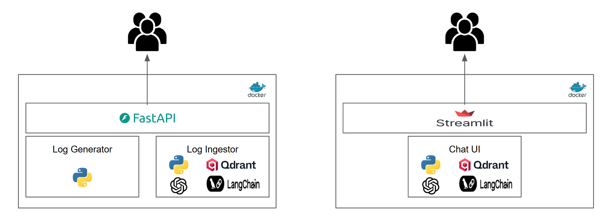
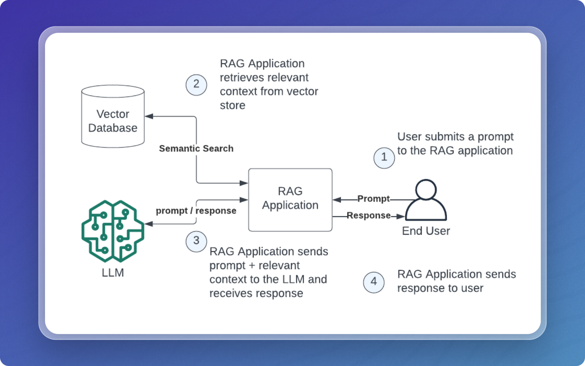
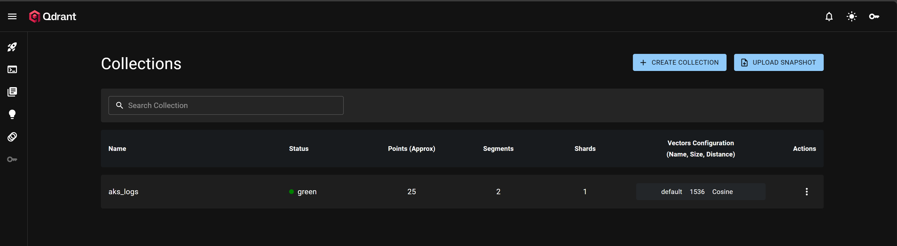
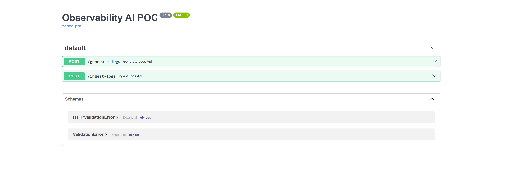

# Observability AI PoC

A proof-of-concept project for observability and AI-driven log analysis.

This project demonstrates a practical approach to observability using AI techniques for log analysis. It provides tools to ingest, generate, and analyze logs, leveraging Retrieval-Augmented Generation (RAG) to enable advanced querying and insights from log data.

## Key features:

- Automated log ingestion and tracking
- Synthetic log generation for testing and simulation
- RAG-based querying for intelligent log search and summarization
- Integration with vector databases (e.g., Qdrant) for efficient semantic search
- Modular Python codebase for easy extension and experimentation

The project is ideal for experimenting with AI-driven observability workflows, building prototypes for log analytics, and exploring how LLMs and - vector search can enhance traditional monitoring systems.

## Project Structure

```
.
├── ingestracker/           # Tracks ingested log files
│   └── ingested_files.json
├── input-logs/             # Contains input log files for processing (Generated by log_generator.py)
├── lenv/                   # Python virtual environment (auto-generated)
├── logs/                   # Output or processed logs (currently empty)
├── src/                    # Source code for log ingestion, generation, and querying
│   ├── api.py              # (Optional) API endpoints for the project to generate sample logs and ingest them into Qdrant DB
│   ├── app.py              # Streamlit or main app entry point
│   ├── ingest_logs.py      # Ingesting logs into Qdrant DB
│   ├── log_generator.py    # Synthetic log generator
│   ├── rag_query_log.py    # RAG-based log querying
├── requirements.txt        # Python dependencies
├── Dockerfile              # Docker file for containerization
├── docker-compose.yml      # Docker compose yaml for running the entire setup in local
```

## Architecture



## RAG Overview



## Setup

1. **Run Qdrant DB in localhost**
     ```
     docker run -d -p 6333:6333 --name qdrant qdrant/qdrant
     ```
	 - The Qdrant UI will be accessible at http://localhost:6333/dashboard
	

2. **Clone the repository:**
	 ```sh
	 git clone <repo-url>
	 cd observability-ai-poc
	 ```

3. **Create and activate a virtual environment (optional if `lenv/` is not used):**
	 ```sh
	 python -m venv lenv
	 . lenv\Scripts\activate
	 ```

4. **Install dependencies:**
	 ```sh
	 pip install -r requirements.txt
	 ```

## Usage

- **Generate Sample logs (In VSC Code Terminal):**
	```sh
	python src/log-generator.py <YYYY-MM-DD> <Number of log entries you need per file>
	```

- **Ingest logs into Qdrant (In VSC Code Terminal):**
	```sh
	python src/ingest-logs.py <Qdrant Collection Name>
	```

- **Query logs using RAG (In VSC Code Terminal):**
	```sh
	python src/rag_query_log.py
	```

- **Run both the apps (API and Streamlit UI) in local docker environment:**
    - This will start both FastAPI and Streamlit UI
	- You can access the apps in the corresponding URLs (shown below)
    ```sh
	docker-compose up
	```

- **Running Swagger separately for generating and ingesting logs:**
    - Start the uvicorn server with api.py 
    ```sh
	cd src
	uvicorn api:app --reload
	```
	- This will start the FastAPI app at http://localhost:8000/docs
	- You can use the generate_logs and ingest_logs apis to do the tasks
	- Inputs:
	  - generate_logs: 
	    - Date String: YYYY-MM-DD
		- Number of log entries needed: Any number. Default value is 2000
	  - ingest_logs:
	    - Collection Name: Unique Qdrant collection name
	- This uvicorn app can be closed or killed after the ingestion is done. It is used only for the Ingestion
    

- **Running Streamlit Chat UI seprately:**
    - Start the Streamlit application for running the Chat UI
	```sh
	cd src
	streamlit run app.py
	```
	- This will open the Chat UI at http://localhost:8501
	


